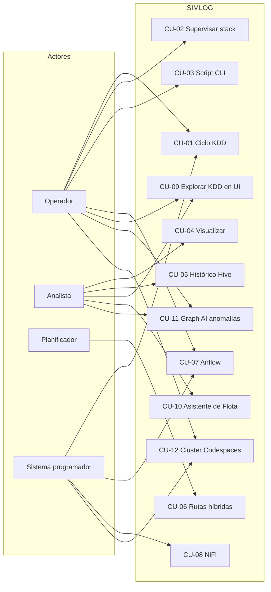

# Casos de uso — SIMLOG España

Documento funcional para la plataforma en modo standalone.

## Actores

| Actor | Descripción |
|-------|-------------|
| **Operador de plataforma** | Arranca/para servicios, lanza DAGs, ejecuta scripts. |
| **Analista logístico** | Consulta mapa, métricas, histórico. |
| **Planificador** | Evalúa rutas híbridas y alternativas. |
| **Sistema programador** | Airflow, NiFi, cron — ejecución automática. |

## Catálogo

| ID | Caso de uso | Actor principal | Resultado |
|----|-------------|-----------------|-----------|
| CU-01 | Ejecutar ciclo KDD (ingesta → procesamiento) | Operador / Programador | Snapshot en Kafka/HDFS y datos en Cassandra/Hive |
| CU-02 | Supervisar y gobernar el stack | Operador | Servicios coherentes (puertos / estado) |
| CU-03 | Gestionar stack vía script CLI | Operador | `simlog_stack.py start/status/stop` |
| CU-04 | Visualizar estado de red y camiones | Analista | Dashboard Streamlit / mapa |
| CU-05 | Consultar histórico analítico | Analista | Hive / SQL supervisado (+ analítica Hive 24h: riesgo por hub y top causas) |
| CU-06 | Evaluar rutas híbridas | Planificador | Rutas y métricas en UI de planificación |
| CU-07 | Orquestar con Airflow (fases o maestro) | Operador / Programador | DAG runs e informes bajo `reports/kdd/` |
| CU-08 | Ingestar vía NiFi con trigger periódico | Programador | Flujo hacia Kafka/HDFS según `nifi/` |
| CU-09 | Explorar y validar el ciclo KDD en el dashboard | Analista / Operador | Fases enlazadas a código y datos; prueba OpenWeather; simulación por paso; topología sin duplicar mapas |
| CU-10 | Consultar operativamente con “Asistente de Flota” | Analista / Operador | Traducción lenguaje natural → CQL/HiveSQL supervisado + `st.dataframe` |
| CU-11 | Detectar anomalías en el grafo con Graph AI | Operador / Analista | NetworkX metrics + scoring + persistencia en `graph_anomalies` |
| CU-12 | Desplegar clúster didáctico en GitHub Codespaces | Operador / Docente | Hadoop+Spark+Kafka+Jupyter en perfil aislado `*.codespaces.*` |

## Detalle breve

### CU-01 — Ejecutar ciclo KDD

- **Precondiciones:** HDFS, Kafka, Cassandra (y opcionalmente Hive) activos.
- **Flujo:** ingesta genera JSON → Kafka + HDFS → Spark procesa → Cassandra + Hive.
- **Disparadores:** Streamlit “Paso siguiente”, Airflow `dag_maestro_smart_grid`, DAGs `simlog_kdd_*`, NiFi.

### CU-02 — Supervisar el stack

- **Flujo:** panel Streamlit “Servicios” o `scripts/comprobar_stack.sh` / API si está expuesta.

### CU-03 — Gestionar stack por CLI

- **Comandos:** `python -u scripts/simlog_stack.py start|status|stop` desde la raíz del proyecto (venv activado).
- **Nota:** no sustituye la configuración de `AIRFLOW_HOME` ni de `[api] base_url` para Airflow.

### CU-04 — Visualizar estado operativo

- **Entrada:** lecturas desde Cassandra en `app_visualizacion.py`.

### CU-05 — Histórico

- **Entrada:** Hive (`logistica_db` u otra base definida en el proyecto).

- **Enfoque analítico 24h:** consultar incidencias derivadas en Hive sobre `logistica_espana.historico_nodos`, clasificando por `estado`, `motivo_retraso` y `clima_actual`.
- **Resultados para el gestor:** informes (1) **Riesgo por hub (últimas 24h)** y (2) **Top causas (últimas 24h)**.

### CU-06 — Rutas híbridas

- **UI:** vistas de planificación / mapa híbrido en el proyecto.

### CU-07 — Airflow

- **Entrada:** UI `http://localhost:8088` (puerto típico SIMLOG) con api-server + scheduler activos.
- **DAGs:** fases `simlog_kdd_00_infra` … `simlog_kdd_99_consulta_final`; maestro `dag_maestro_smart_grid`.

### CU-08 — NiFi

- **Documentación:** `nifi/README_NIFI.md`, especificación de flujo en `nifi/flow/`.

### CU-09 — Explorar ciclo KDD en Streamlit

- **Precondiciones:** proyecto clonado; opcionalmente ingesta previa para ver `ultimo_payload.json`.
- **Flujo principal:** abrir pestaña **Ciclo KDD** → elegir fase (◀ ▶ o desplegable) → leer reglas / vistas previas / grafo topológico según fase → en 1–2 ajustar paso, ejecutar ingesta o guardar instantánea y comparar payload → en 1–2 opcionalmente introducir API key y consultar OpenWeather.
- **Postcondiciones:** comprensión del alineamiento fase–script–datos sin exigir lectura directa de todo el código.
- **Diseño:** `docs/DASHBOARD_KDD_UI.md`.

### CU-10 — Asistente de Flota (lenguaje natural → SQL supervisado)

- **Entrada:** usuario pregunta en lenguaje natural (ej. “¿Dónde está el camión 1?”).
- **Flujo:** `resolver_intencion_gestor()` traduce keywords a consultas preaprobadas (whitelist) y ejecuta contra Cassandra (tiempo real) o Hive (histórico).
- **Salida:** tabla `st.dataframe` + opción “Ver consulta SQL”.
- **Restricción clave:** no se ejecuta SQL arbitrario del usuario; solo plantillas alineadas al esquema real.

### CU-11 — Graph AI anomalías (microservicio desacoplado)

- **Entrada:** snapshot del grafo (nodos/aristas) materializado en Cassandra.
- **Flujo:** Airflow llama al microservicio FastAPI `/analyze-graph` (NetworkX) y persiste los resultados en Cassandra (`graph_anomalies`).
- **Salida:** anomalías por nodo con `anomaly_score` y métricas asociadas; opcional Kafka `graph_anomalies`.

### CU-12 — Desplegar clúster en GitHub Codespaces

- **Precondiciones:** repositorio actualizado, Codespace activo, Docker operativo.
- **Flujo principal:** ejecutar `docker compose -f docker-compose.codespaces.yml up -d --build` -> publicar puertos (`9870`, `8080`, `8888`) en modo Public -> validar UIs y logs.
- **Postcondición:** clúster docente disponible sin alterar el `docker-compose.yml` principal.
- **Documentación:** `docs/CODESPACES_CLUSTER.md`.

---

## Diagrama de casos de uso (Mermaid)

> Reproducible en GitHub, GitLab, VS Code (Mermaid) y editores compatibles.

