# Diagramas UML en Mermaid — SIMLOG

Diagramas equivalentes a los PlantUML de `docs/uml/` (casos de uso, componentes, secuencia). **Fuente recomendada** para visores que soporten Mermaid (GitHub, GitLab, VS Code, MkDocs con extensión).

---

## 1. Casos de uso (resumen)

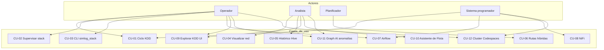

---

## 2. Componentes y datos

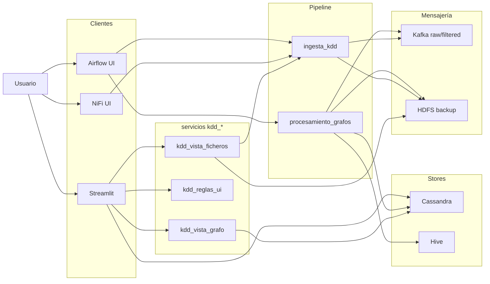

---

## 3. Secuencia — ciclo KDD ~15 min

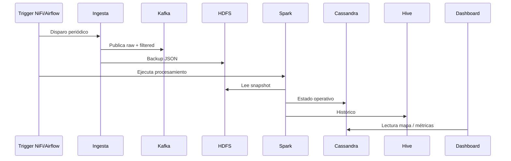

---

## 4. Secuencia — exploración KDD y OpenWeather (dashboard)

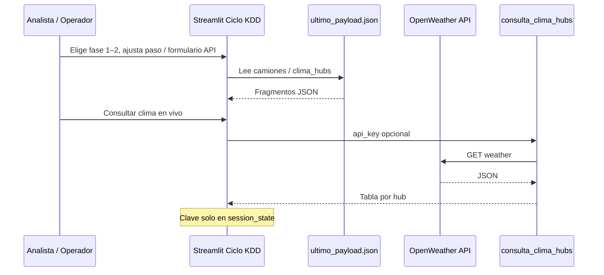

---

## 5. Secuencia — arranque stack (CLI)

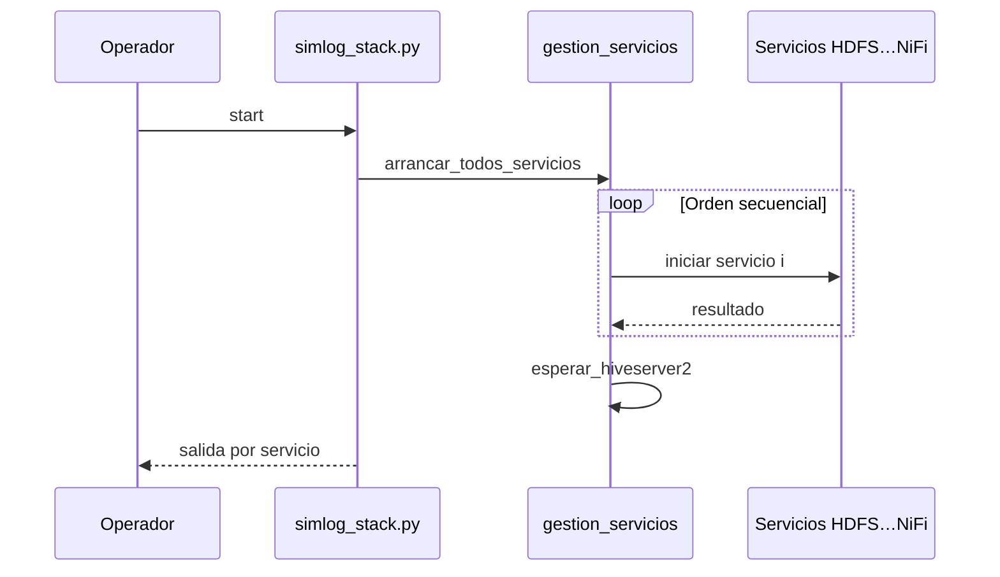

---

## 6. Despliegue lógico (standalone)

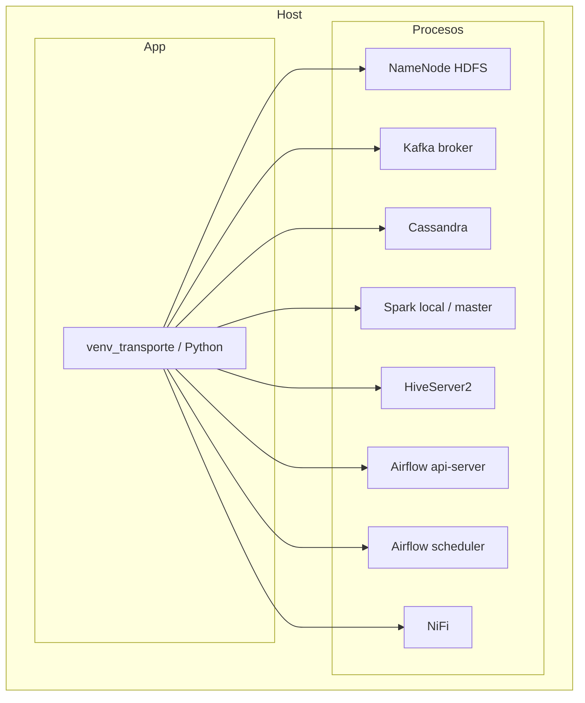

---

## 6.b Despliegue lógico (perfil Codespaces aislado)

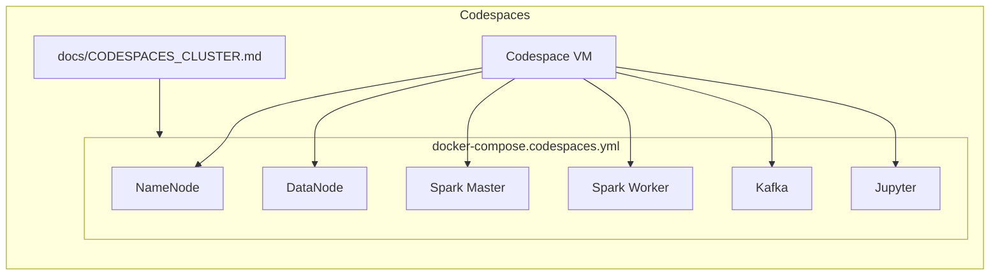

---

## 7. Secuencia — Cuadro de mando (Hive) riesgo por hub 24h

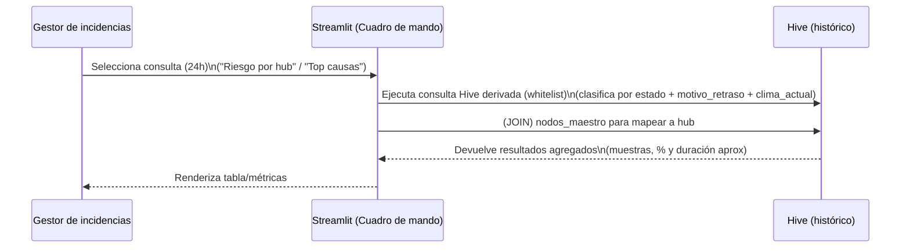

---

## Nota sobre PlantUML

Los ficheros `docs/uml/*.puml` se mantienen como referencia alternativa (actualizados en paralelo con CU-09 y módulos UI KDD); la documentación principal usa **Mermaid** en este archivo y en `DISENO_SISTEMA.md` y `CASOS_DE_USO.md`.

---

## 8. Secuencia — Asistente de Flota (lenguaje natural → SQL)

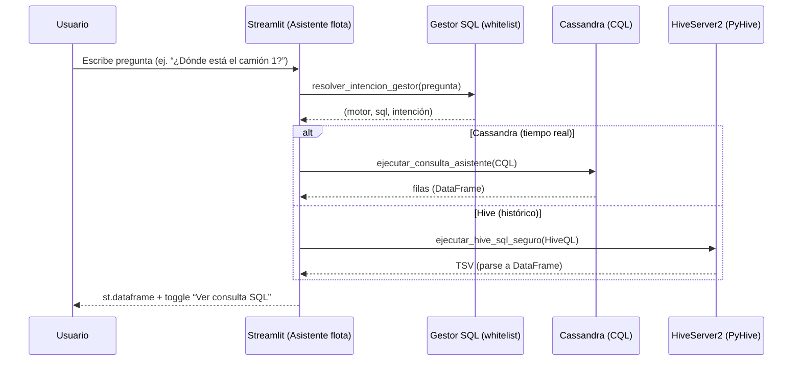

---

## 9. Componentes — Integración Asistente de Flota + Graph AI

```mermaid
flowchart LR
  subgraph UI
    ST[Streamlit UI]
  end

  subgraph Backend_SQL
    GSQL[Gestor consultas (whitelist)]
  end

  subgraph Datos
    CS[Cassandra keyspace]
    HV[Hive (histórico)]
  end

  subgraph Graph_AI
    FAPI[FastAPI Graph AI]
    NX[NetworkX (metrics + scoring)]
  end

  subgraph Orquestación
    DAG[Airflow DAG: simlog_graph_ai_anomalias]
  end

  ST --> GSQL
  GSQL --> CS
  GSQL --> HV

  DAG --> CS
  DAG --> FAPI
  FAPI --> NX
  FAPI --> CS
```

---

## 10. Secuencia — Graph AI análisis (Airflow → FastAPI → Cassandra)

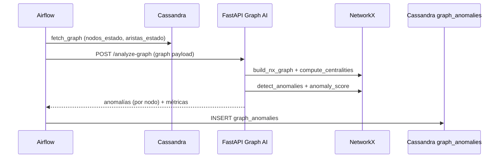

---

## 11. Diagrama (modelo conceptual) — Graph AI

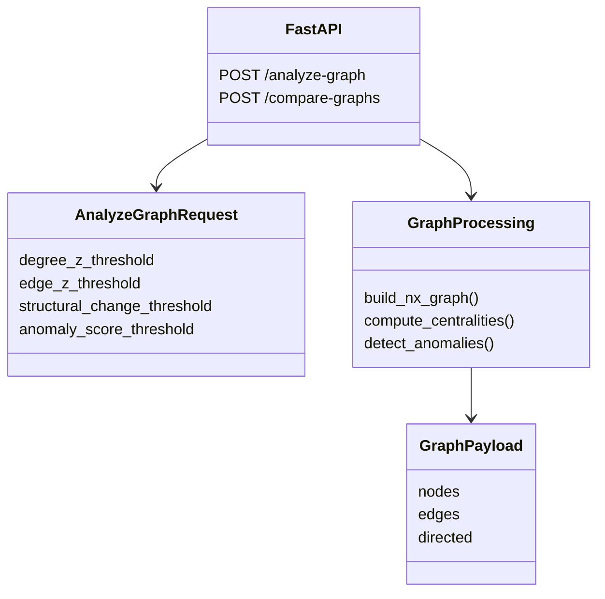
