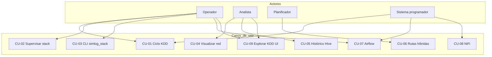
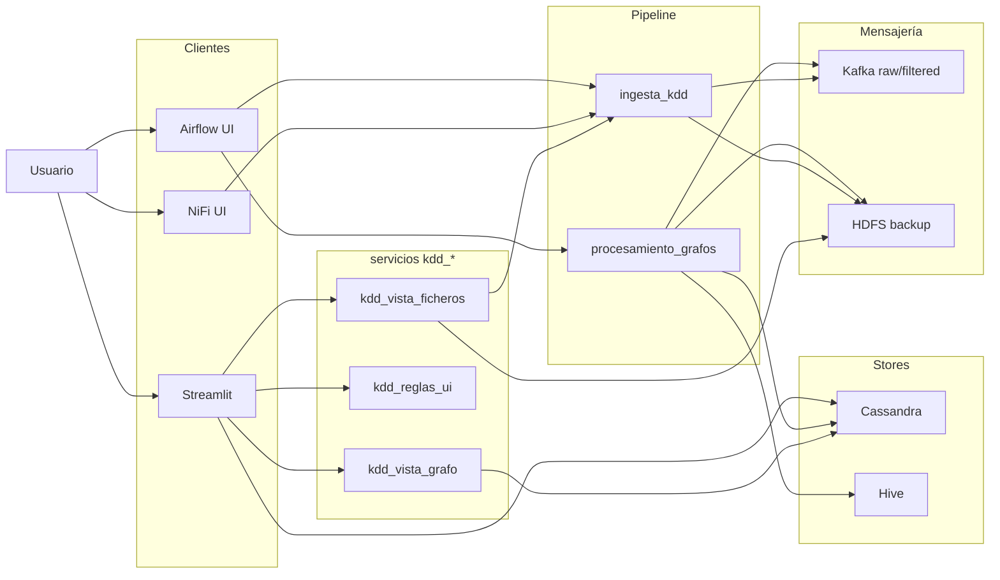
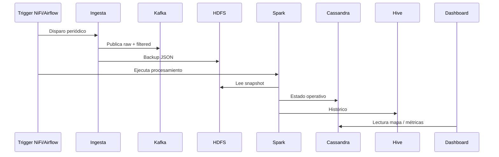
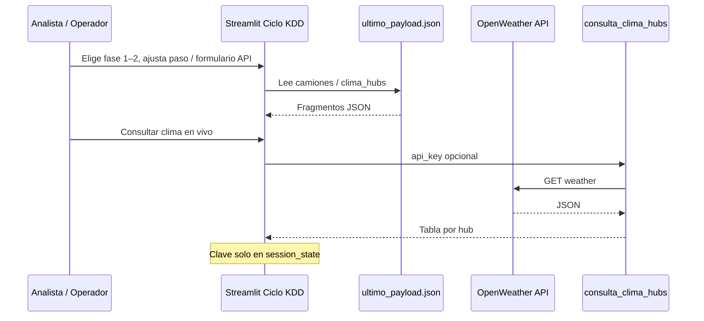
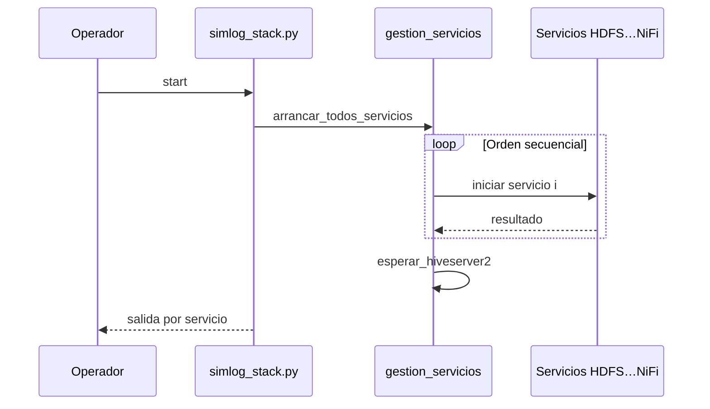
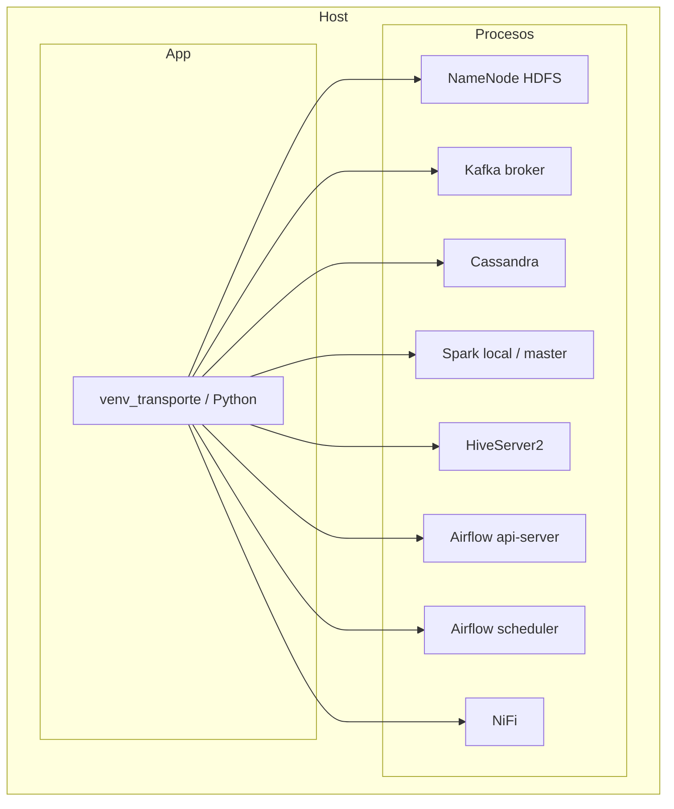

# Diagramas UML en Mermaid — SIMLOG

Diagramas equivalentes a los PlantUML de `docs/uml/` (casos de uso, componentes, secuencia). **Fuente recomendada** para visores que soporten Mermaid (GitHub, GitLab, VS Code, MkDocs con extensión).

---

## 1. Casos de uso (resumen)

---

## 2. Componentes y datos

---

## 3. Secuencia — ciclo KDD ~15 min

---

## 4. Secuencia — exploración KDD y OpenWeather (dashboard)

---

## 5. Secuencia — arranque stack (CLI)

---

## 6. Despliegue lógico (standalone)

---

## Nota sobre PlantUML

Los ficheros `docs/uml/*.puml` se mantienen como referencia alternativa (actualizados en paralelo con CU-09 y módulos UI KDD); la documentación principal usa **Mermaid** en este archivo y en `DISENO_SISTEMA.md` y `CASOS_DE_USO.md`.
