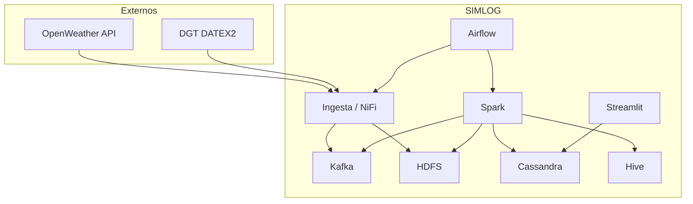
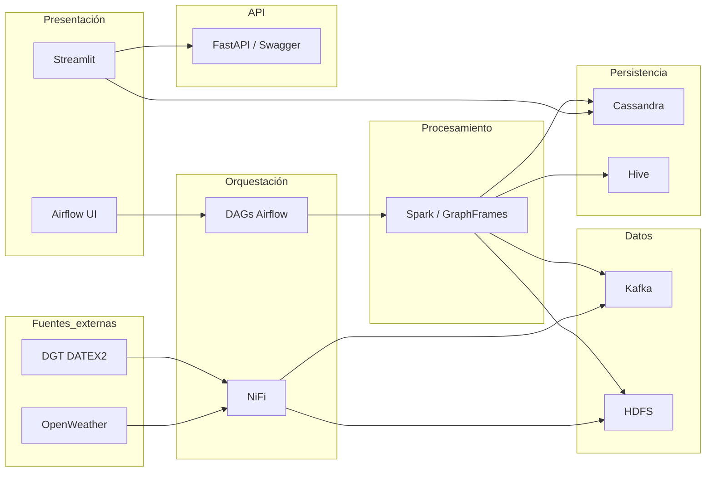

# Diseño del sistema — SIMLOG

## Objetivo

SIMLOG implementa un ciclo KDD logístico de extremo a extremo con foco en:

- operación en modo **standalone** (una máquina),
- desacople vía **Kafka** y **HDFS**,
- **Cassandra** (estado operativo) vs **Hive** (histórico + analítica derivada 24h para Cuadro de mando),
- operación por **Streamlit**, **NiFi**, **Airflow** y **scripts CLI** (`scripts/simlog_stack.py`).

## Arquitectura lógica (capas)

1. **Ingesta** — `ingesta_kdd.py` y/o NiFi: snapshot cada ~15 min (clima, red, GPS), con OpenWeather opcional y respaldo meteorológico DGT.
2. **Mensajería y backup** — Kafka (`transporte_dgt_raw`, `transporte_raw`, `transporte_filtered`) y HDFS (`HDFS_BACKUP_PATH`).
3. **Procesamiento** — Spark (`procesamiento/procesamiento_grafos.py`): grafo, autosanación, PageRank.
4. **Persistencia** — Cassandra (operativo) y Hive (histórico y analítica de incidencias para reporting 24h).
5. **Orquestación** — Airflow (DAGs en `~/airflow/dags`, código en `orquestacion/`), NiFi (trigger), scripts de stack.
6. **Presentación** — Streamlit, enlaces a UIs del stack (HDFS, Spark, etc.).

### 2.1 Kafka (por qué existe en el diseño)

- **Desacople**: la ingesta publica el snapshot aunque el procesamiento Spark vaya más lento o se ejecute en otra ventana.
- **Auditoría / trazabilidad**: el topic permite inspeccionar el flujo de datos sin depender de la UI.
- **Reproceso (si retención lo permite)**: re-ejecutar Spark sobre una ventana de mensajes sin volver a llamar a APIs externas.

### 3.1 Spark: grafo, autosanación y métricas (PageRank)

El procesamiento (`procesamiento/procesamiento_grafos.py`) convierte el snapshot en un modelo operativo:

- **Grafo** (GraphFrames): vértices (nodos) y aristas (rutas).
- **Autosanación**: elimina rutas *Bloqueadas* y penaliza *Congestionadas* (para priorizar desvíos).
- **Métricas**: PageRank para estimar **criticidad** de nodos.
- **Persistencia**:
  - Cassandra (tiempo real): `nodos_estado`, `aristas_estado`, `tracking_camiones`, `pagerank_nodos`.
  - Hive (opcional): histórico/analítica si `SIMLOG_ENABLE_HIVE=1`.

### 6.2 Rutas alternativas (planificación)

La planificación de rutas alternativas se expone en la UI (pestaña **Rutas híbridas**) y combina:

- **Catálogo de red** (`datos/rutas_red_simlog.yaml`) para topología y distancias.
- **Estado/incidencias** (clima/DGT/obras) para bloquear o penalizar tramos/nodos.
- **Ruta principal**: mínimo saltos (BFS) sobre el catálogo.
- **Alternativas**: recalcular caminos simulando cortes por tramo o nodo intermedio (plan B operativo).

## Requisitos actualizados (resumen)

Funcionales incorporados en la versión actual:

- Consultas supervisadas en Hive/Cassandra con salida tabular amigable.
- Ejecución de SQL/CQL de lectura desde frontend (modo seguro).
- Constructor de informes a medida por selección de tabla/campos/filtros.
- Exportación de informes en PDF y gestión de plantillas personalizadas.
- Buscador semántico en cabecera con navegación directa a la sección objetivo.
- Inclusión de Swagger API en el panel de servicios y en el resumen del stack.

No funcionales reforzados:

- Seguridad: ejecución restringida a sentencias de lectura.
- Trazabilidad: plantilla de informe persistida en fichero versionable.
- Usabilidad: navegación determinista por pestañas (`active_tab`) desde hallazgos.

### 6.1 Pestaña «Ciclo KDD» (diseño de UI)

La pestaña **Ciclo KDD** no sustituye a Airflow ni a los scripts; sirve para **documentar en vivo** el alineamiento fase ↔ código ↔ datos. Diseño detallado: **[DASHBOARD_KDD_UI.md](DASHBOARD_KDD_UI.md)**.

- **Fases 1–2**: simulación por paso, vista de `camiones` y `clima_hubs` desde `reports/kdd/work/ultimo_payload.json`, prueba de OpenWeather con API key opcional en formulario y visibilidad de `source` / `fallback_activo` cuando entra el respaldo DGT.
- **Fases 3–5**: reglas de negocio en un solo bloque markdown; **una** vista topológica Altair (misma red); mapa geográfico solo en otras pestañas.
- **Lista completa de fases**: sin duplicar widgets interactivos (solo resumen textual).

## Decisiones de diseño

| Decisión | Motivo |
|----------|--------|
| Kafka raw + filtered | Auditoría vs consumo operativo |
| Persistencia dual C* + Hive | Latencia vs analítica SQL |
| Hive opcional en Spark (`SIMLOG_ENABLE_HIVE`) | Evitar bloqueos de metastore en desarrollo |
| Airflow 3 + `LocalExecutor` | `[api] base_url` y puerto deben coincidir con el api-server (p. ej. 8088) para no dejar tareas en cola |
| `simlog_stack.py` | Arranque/parada secuencial reproducible tras reinicio |
| systemd (YARN + Airflow) | Evitar caídas de `scheduler`/`api-server` y el “reinicio manual” de YARN por conflicto de puertos |
| Perfil Codespaces aislado (`*.codespaces.*`) | Evitar conflictos con `docker-compose.yml` principal y facilitar prácticas cloud |
| `widget_scope` en vistas KDD | Prefijo único (`kdd_principal` vs `kdd_lista_fN`) para claves Streamlit y un solo formulario OpenWeather por vista |
| Panel de reglas unificado | Menos repetición textual al navegar fases 3–5; misma figura topológica con leyenda clara |
| SQL/CQL seguro en frontend | Permitir exploración del dato sin abrir riesgo de escritura/borrado accidental |
| Plantillas de informe en JSON | Reutilización operativa y generación PDF consistente para negocio |
| Navegación por buscador semántico | Reducir tiempo de acceso a funciones cuando aumenta el número de pestañas/servicios |
| Respaldo meteorológico DGT | Mantener continuidad funcional del snapshot aunque OpenWeather no responda o la clave no sea válida |

## Perfil de despliegue: clúster en GitHub Codespaces

Para uso docente/demostrativo cloud se define un perfil separado del stack principal:

- `docker-compose.codespaces.yml`
- `Dockerfile.codespaces`
- `hadoop.codespaces.env`
- guía operativa: `docs/CODESPACES_CLUSTER.md`

Este perfil levanta Hadoop+Spark+Kafka+Jupyter con límites de recursos conservadores y puertos preparados para publicación en Codespaces.

### Flujo operativo del perfil Codespaces

1. Crear Codespace sobre `main`.
2. Arrancar con `docker compose -f docker-compose.codespaces.yml up -d --build`.
3. Publicar puertos `9870`, `8080`, `8888` como `Public`.
4. Validar estado por logs/UIs.
5. Parar con `docker compose -f docker-compose.codespaces.yml down` (o `down -v` para limpieza completa).

## Flujo operativo recomendado

1. Arrancar stack: `python -u scripts/simlog_stack.py start` (o DAG de arranque en Airflow).
2. Comprobar: `… status` o panel de servicios.
3. Ejecutar pipeline:
   - Automático: `simlog_maestro` cada 15 min (o `SIMLOG_INGESTA_INTERVAL_MINUTES`).
   - Manual: cadena `simlog_kdd_01_seleccion` … `simlog_kdd_05_interpretacion`.
   - Catálogo completo: `docs/AIRFLOW_DAGS_SIMLOG.md`.
4. Si OpenWeather no responde, validar que el payload entra con `source=dgt` y `fallback_activo=true` en `clima_hubs`.
5. Parar demo: `… stop`.

## Restricciones

- Triggers simultáneos NiFi + Airflow sobre la misma ingesta pueden duplicar trabajo; coordinar ventanas.
- `SPARK_MASTER=yarn` solo si el clúster YARN está preparado.
- Secretos: `.env` en raíz (cargado por `config.py`); no commitear claves.

---

## Diagrama de contexto (Mermaid)

## Diagrama de componentes (Mermaid)

