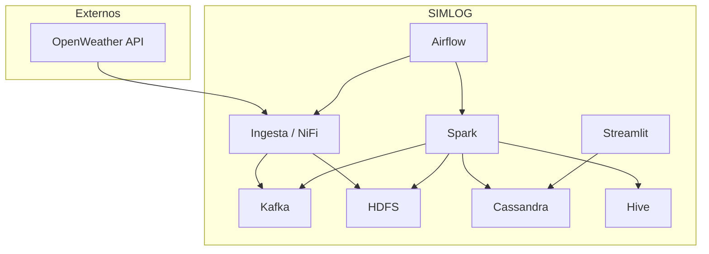
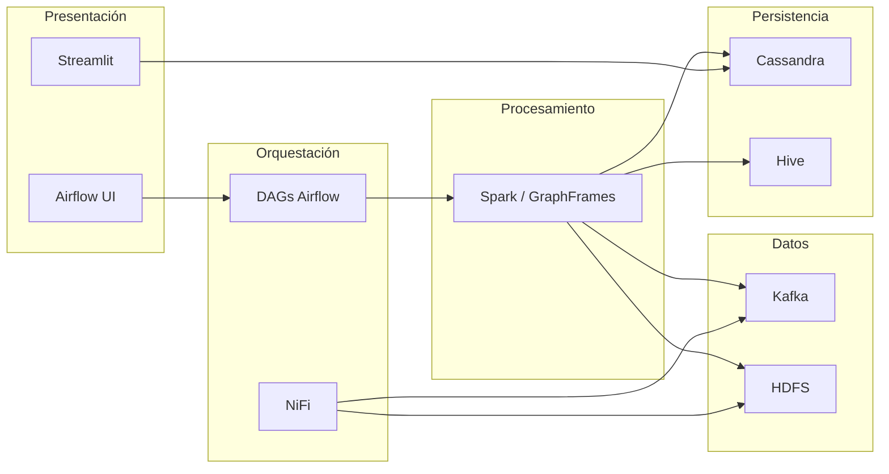

# Diseño del sistema — SIMLOG

## Objetivo

SIMLOG implementa un ciclo KDD logístico de extremo a extremo con foco en:

- operación en modo **standalone** (una máquina),
- desacople vía **Kafka** y **HDFS**,
- **Cassandra** (estado operativo) vs **Hive** (histórico),
- operación por **Streamlit**, **NiFi**, **Airflow** y **scripts CLI** (`scripts/simlog_stack.py`).

## Arquitectura lógica (capas)

1. **Ingesta** — `ingesta_kdd.py` y/o NiFi: snapshot cada ~15 min (clima, red, GPS).
2. **Mensajería y backup** — Kafka (`transporte_raw`, `transporte_filtered`) y HDFS (`HDFS_BACKUP_PATH`).
3. **Procesamiento** — Spark (`procesamiento/procesamiento_grafos.py`): grafo, autosanación, PageRank.
4. **Persistencia** — Cassandra (operativo) y Hive (histórico).
5. **Orquestación** — Airflow (DAGs en `~/airflow/dags`, código en `orquestacion/`), NiFi (trigger), scripts de stack.
6. **Presentación** — Streamlit, enlaces a UIs del stack (HDFS, Spark, etc.).

### 6.1 Pestaña «Ciclo KDD» (diseño de UI)

La pestaña **Ciclo KDD** no sustituye a Airflow ni a los scripts; sirve para **documentar en vivo** el alineamiento fase ↔ código ↔ datos. Diseño detallado: **[DASHBOARD_KDD_UI.md](DASHBOARD_KDD_UI.md)**.

- **Fases 1–2**: simulación por paso, vista de `camiones` y `clima_hubs` desde `reports/kdd/work/ultimo_payload.json`, prueba de OpenWeather con API key opcional en formulario.
- **Fases 3–5**: reglas de negocio en un solo bloque markdown; **una** vista topológica Altair (misma red); mapa geográfico solo en otras pestañas.
- **Lista completa de fases**: sin duplicar widgets interactivos (solo resumen textual).

## Decisiones de diseño

| Decisión | Motivo |
|----------|--------|
| Kafka raw + filtered | Auditoría vs consumo operativo |
| Persistencia dual C* + Hive | Latencia vs analítica SQL |
| Hive opcional en Spark (`SIMLOG_ENABLE_HIVE`) | Evitar bloqueos de metastore en desarrollo |
| Airflow 3 + `LocalExecutor` | `[api] base_url` y puerto deben coincidir con el api-server (p. ej. 8088) para no dejar tareas en cola |
| `simlog_stack.py` | Arranque/parada secuencial reproducible tras reinicio |
| `widget_scope` en vistas KDD | Prefijo único (`kdd_principal` vs `kdd_lista_fN`) para claves Streamlit y un solo formulario OpenWeather por vista |
| Panel de reglas unificado | Menos repetición textual al navegar fases 3–5; misma figura topológica con leyenda clara |

## Flujo operativo recomendado

1. Arrancar stack: `python -u scripts/simlog_stack.py start` (o DAG de arranque en Airflow).
2. Comprobar: `… status` o panel de servicios.
3. Ejecutar pipeline: DAG maestro cada 15 min y/o cadena `simlog_kdd_01_seleccion` … (si servicios ya están arriba).
4. Parar demo: `… stop`.

## Restricciones

- Triggers simultáneos NiFi + Airflow sobre la misma ingesta pueden duplicar trabajo; coordinar ventanas.
- `SPARK_MASTER=yarn` solo si el clúster YARN está preparado.
- Secretos: `.env` en raíz (cargado por `config.py`); no commitear claves.

---

## Diagrama de contexto (Mermaid)

## Diagrama de componentes (Mermaid)

