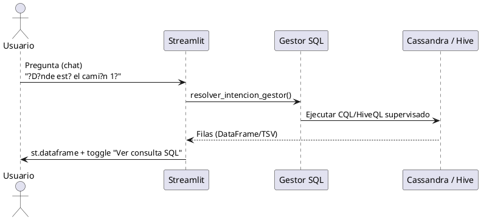

# Manual de Desarrollador ? SIMLOG Espa?a

Gu?a para extender y operar la plataforma SIMLOG, incluyendo:

- **FAQ IA** (microservicio local + base de conocimiento JSON)
- **Asistente de Flota** (lenguaje natural ? consultas supervisadas)
- **Graph AI** (FastAPI + NetworkX) para detecci?n de anomal?as
- Integraci?n con **Cassandra**, **Hive**, **Airflow**

## 1. Estructura general (repo)

Componentes principales:

- `ingesta/`: genera snapshots (clima OpenWeather o respaldo DGT + incidentes + GPS simulado) y publica en Kafka + backup JSON en HDFS. Incluye `ingesta_dgt_datex2.py` para integrar incidencias reales DATEX2.
- `procesamiento/`: Spark (GraphFrames) ? escribe en Cassandra y (opcionalmente) Hive.
- `orquestacion/`: DAGs Airflow.
- `servicios/`: m?dulos para Streamlit (UI) y consultas supervisadas (Cassandra/Hive).
- `servicios/api_faq_ia.py`, `servicios/ui_faq_ia.py`, `servicios/faq_knowledge_base.json`: FAQ IA operativa.
- `graph_ai/`: microservicio de an?lisis de grafos (FastAPI + NetworkX).
- `cassandra/esquema_logistica.cql`: DDL de tablas.

## 2. FAQ IA (microservicio local + KB JSON)

### 2.1 Qu? hace

El FAQ IA resuelve preguntas frecuentes sobre operaci?n y uso del proyecto sin salir del dashboard:

- arranque del stack,
- informes PDF,
- estado de NiFi,
- ubicaciones Swagger/OpenAPI,
- dudas recurrentes de consultas y servicios.

No utiliza un LLM externo. La recuperaci?n se basa en:

- tokenizaci?n local,
- similitud l?xica (`Jaccard`),
- similitud difusa (`SequenceMatcher`),
- base de conocimiento editable en JSON.

### 2.2 M?dulos y responsables

- `servicios/api_faq_ia.py`
  - API FastAPI del FAQ.
  - Endpoints: `/health`, `/api/v1/faq/questions`, `/api/v1/faq/ask`.
  - Respuesta estructurada: `answer`, `confidence`, `matched_question`, `suggestions`, `sources`, `engine`.
- `servicios/ui_faq_ia.py`
  - Panel Streamlit embebido en la pesta?a **Servicios**.
  - Consulta el microservicio, muestra respuesta y mantiene historial en `st.session_state`.
- `servicios/faq_knowledge_base.json`
  - Base versionada con `question`, `keywords`, `answer`, `sources`.

### 2.3 Arranque y documentaci?n interactiva

```bash
cd ~/proyecto_transporte_global
source venv_transporte/bin/activate
uvicorn servicios.api_faq_ia:app --host 0.0.0.0 --port 8091
```

Documentaci?n:

- Swagger UI: `http://<host>:8091/docs`
- ReDoc: `http://<host>:8091/redoc`
- OpenAPI JSON: `http://<host>:8091/openapi.json`

### 2.4 C?mo ampliar la base de conocimiento

1. Edita `servicios/faq_knowledge_base.json`.
2. A?ade un objeto con:
   - `question`
   - `keywords`
   - `answer`
   - `sources`
3. Mant?n respuestas cortas, operativas y trazables a ficheros reales.
4. Reinicia el servicio FAQ IA si quieres garantizar recarga limpia.

## 3. Asistente de Flota (lenguaje natural ? CQL/HiveQL supervisado)

### 2.1 Qu? hace

El asistente traduce una pregunta en lenguaje natural a:

- **CQL Cassandra** (tiempo real)
- **HiveQL** (hist?rico) usando PyHive

No ejecuta SQL arbitrario: usa **whitelist**/plantillas y heur?sticas.

### 2.2 M?dulos y responsables

- `servicios/ui_asistente_flota.py`
  - Interfaz Streamlit: `st.chat_input`, muestra `st.dataframe` y el toggle ?Ver consulta SQL?.
  - Mantiene historial en `st.session_state`.
- `servicios/gestor_consultas_sql.py`
  - Mapeo (diccionario + heur?sticas) de intenci?n ? SQL/CQL supervisado.
  - Extracci?n segura del identificador del cami?n (ej. `camion_1`, `CAM-001`).
- `servicios/consultas_cuadro_mando.py`
  - Expone `ejecutar_hive_sql_seguro(sql)` con ejecuci?n segura v?a PyHive.
  - Mantiene whitelist de consultas Cassandra/Hive para otras partes de la UI.

### 2.3 Integraci?n Hive sin beeline de consola

`ejecutar_hive_sql_seguro()` usa PyHive contra HiveServer2:

- Host/puerto se obtiene de `HIVE_SERVER` o `HIVE_JDBC_URL`.
- Ajusta timeout con `HIVE_QUERY_TIMEOUT_SEC`.
- Intenta modos de auth compatibles (NOSASL/NONE) seg?n entorno.

### 2.3.1 YARN, conflictos de puerto y Beeline (verificaci?n operativa)

Las consultas Hive que lanzan trabajos en cluster (p. ej. motor MapReduce o configuraci?n que delega en YARN) necesitan que el **ResourceManager** est? en marcha. Si desde Beeline o el cliente ves errores de conexi?n al **puerto 8032** (`Connection refused` hacia `nodo1` o el host del RM), suele faltar **YARN**:

```bash
# Tras tener HDFS operativo (t?picamente ya levantado)
/opt/hadoop/sbin/start-yarn.sh
```

Comprueba con `jps` que existen procesos `ResourceManager` y `NodeManager`, y que el RM escucha en **8032** (RPC).

**Conflicto con la UI web del ResourceManager (puerto 8088):** por defecto, YARN enlaza la consola del RM en **8088**. En un nodo donde tambi?n corre **Airflow** (u otro servicio que ya use 8088), el ResourceManager **falla al arrancar** (`BindException` / ?La direcci?n ya se est? usando?) y no quedar? proceso escuchando en 8032. En ese caso hay que cambiar la direcci?n de la web del RM en `yarn-site.xml`, por ejemplo:

```xml
<property>
  <name>yarn.resourcemanager.webapp.address</name>
  <value>0.0.0.0:18088</value>
</property>
```

(El valor exacto debe ser un puerto libre en la m?quina; **18088** es una convenci?n habitual para no chocar con 8088.) Tras editar, reinicia YARN: `stop-yarn.sh` y `start-yarn.sh`. La UI del cluster quedar? en `http://<host>:18088/` (ajusta firewall y DNS si aplica).

**Base de datos JDBC:** el nombre del esquema Hive del proyecto viene de `HIVE_DB` en `config.py` (por defecto **`logistica_espana`**). Las URLs `jdbc:hive2://.../logistica_db` u otros nombres solo funcionan si ese esquema existe; si Beeline responde que la base no existe, revisa la variable de entorno `HIVE_DB` o usa el nombre por defecto.

Ejemplo de comprobaci?n r?pida con Beeline (ajusta host y usuario):

```bash
export HIVE_HOME=/ruta/a/apache-hive-*-bin
beeline -u 'jdbc:hive2://127.0.0.1:10000/logistica_espana' -n hadoop \
  -e 'SELECT COUNT(*) FROM alertas_historicas;'
```

La primera consulta tras arrancar servicios puede tardar varios minutos (arranque en fr?o de sesi?n y cola YARN).

### 2.4 Extender el asistente (nuevo intent / nueva plantilla)

1. A?ade una nueva intenci?n en `resolver_intencion_gestor()` en `servicios/gestor_consultas_sql.py`.
2. Define la consulta supervisada:
   - Para Cassandra: aseg?rate de que el esquema coincide con `cassandra/esquema_logistica.cql`.
   - Para Hive: define tabla/DDL existente (y ajusta `SIMLOG_HIVE_TABLA_TRANSPORTE` si el nombre difiere).
3. Si necesitas post-procesado (p.ej. ordenar top por `pagerank`), implementa el ajuste en el cliente antes del render (el asistente ya lo soporta en `aplicar_postproceso_gestor`).


### 2.5 A?adir nuevas consultas con categor?as

Las consultas supervisadas de Cassandra y Hive est?n organizadas en **categor?as** para facilitar la navegaci?n en la UI.

#### Estructura de categor?as (Cassandra)

```python
# En servicios/consultas_cuadro_mando.py

CASSANDRA_CATEGORIAS: Dict[str, Dict[str, Any]] = {
    "nodos": {
        "nombre": "Estado de Nodos",
        "descripcion": "Estado operativo de los nodos",
        "icono": "\U0001f4cd",  # pin
        "consultas": ["nodos_estado_resumen", "gestor_nodos_con_incidencias"],
    },
    "tracking": {
        "nombre": "Tracking Camiones",
        "descripcion": "Posici?n GPS y estado de flota",
        "icono": "\U0001f69b",  # truck
        "consultas": ["tracking_camiones", "gestor_camiones_mapa"],
    },
    # ... m?xa1s categor?as
}

def listar_categorias_cassandra() -> List[str]:
    orden = ["nodos", "aristas", "tracking", "pagerank", "eventos", "gestor"]
    return [c for c in orden if c in CASSANDRA_CATEGORIAS]
```

#### Estructura de categor?as (Hive)

```python
HIVE_CATEGORIAS: Dict[str, Dict[str, List[str]]] = {
    "diagnostico": {
        "nombre": "Diagn?stico",
        "descripcion": "Verificaci?n de conexi?n y tablas",
        "icono": "\U0001f527",  # wrench
        "consultas": ["diag_smoke_hive", "tablas_bd"],
    },
    "eventos": {
        "nombre": "Eventos Hist?rico",
        "descripcion": "Hist?rico de eventos de nodos",
        "icono": "\U0001f4cb",  # clipboard
        "consultas": ["eventos_historico_muestra", "eventos_nodos_24h"],
    },
    # ... m?xa1s categor?as
}

def listar_categorias_hive() -> List[str]:
    orden = ["diagnostico", "eventos", "clima", "tracking", "transporte", "rutas", "agregaciones", "gestor"]
    return [c for c in orden if c in HIVE_CATEGORIAS]
```

#### Pasos para a?adir una nueva consulta

1. **Definir la consulta** en `CASSANDRA_CONSULTAS` o `HIVE_CONSULTAS`:
   ```python
   "mi_nueva_consulta": {
       "titulo": "Mi nueva consulta",
       "cql": "SELECT ... FROM ..."
   }
   ```

2. **A?adir a una categor?a existente** (o crear nueva):
   ```python
   CASSANDRA_CATEGORIAS["nodos"]["consultas"].append("mi_nueva_consulta")
   ```

3. **La UI se actualiza autom?xa1ticamente** - no hace falta modificar `cuadro_mando_ui.py`.

#### Categor?as disponibles actualmente

**Cassandra:**
| Clave | Nombre | Icono |
|-------|--------|-------|
| nodos | Estado de Nodos | pin |
| aristas | Estado de Rutas | rail |
| tracking | Tracking Camiones | truck |
| pagerank | PageRank | chart |
| eventos | Eventos | clipboard |
| gestor | Gestor | person |

**Hive:**
| Clave | Nombre | Icono |
|-------|--------|-------|
| diagnostico | Diagn?stico | wrench |
| eventos | Eventos Hist?rico | clipboard |
| clima | Clima Hist?rico | sun |
| tracking | Tracking Camiones | truck |
| transporte | Transporte Ingestado | box |
| rutas | Rutas Alternativas | rail |
| agregaciones | Agregaciones Diarias | chart |
| gestor | Gestor | person |

#### Notas importantes

- El **orden de categor?as** en `listar_categorias_*()` determina el orden en la UI.
- Los **iconos** son emojis UTF-8; usa caracteres v?xa1lidos.
- Cada consulta solo puede estar en **una categor?a**.
- Valida siempre que las columnas de la consulta coincidan con el esquema real (`cassandra/esquema_logistica.cql` o `persistencia_hive.py`).

## 3.b Integraci?n DATEX2 DGT

### Qu? hace

El m?dulo `ingesta/ingesta_dgt_datex2.py`:

1. Descarga el feed XML DATEX2 v3.6 de la DGT.
2. Lo normaliza a un contrato interno con `id_incidencia`, `severity`, `estado`, `carretera`, `municipio`, `provincia`, `lat`, `lon`, `descripcion`.
3. Proyecta cada incidencia al nodo log?stico m?s cercano.
4. Fusiona la se?al DGT con la simulaci?n manteniendo prioridad de `source=dgt`.

### Puntos de extensi?n

- `parsear_xml_datex2(xml_text)`: ampliar extractores XML.
- `mapear_incidencias_a_nodos(...)`: mejorar matching geogr?fico o pasar a aristas.
- `fusionar_estados(...)`: cambiar pol?tica de desempate.
- `obtener_incidencias_dgt(...)`: endurecer cach?, timeout y modo degradado.

### Contrato de salida

- `incidencias_dgt`
- `resumen_dgt`
- `nodos_estado` / `estados_nodos` con:
  - `source`
  - `severity`
  - `peso_pagerank`
  - `id_incidencia`
  - `carretera`, `municipio`, `provincia`
- `clima_hubs` / `clima` con:
  - `source` (`openweather` o `dgt`)
  - `fallback_activo`
  - `estado_carretera`
  - `visibilidad`

### Script standalone

```bash
venv_transporte/bin/python scripts/ejecutar_ingesta_dgt.py --skip-processing
```

### Tests

- `tests/test_ingesta_dgt_datex2.py`
- `tests/test_ingestion.py`

Los tests cubren parseo m?nimo de DATEX2, mapeo a nodos y prioridad del merge frente a la simulaci?n.

### C?mo est? configurado el uso de informaci?n alternativa a OpenWeather

La configuraci?n actual deja a OpenWeather como fuente **preferente pero opcional**. El respaldo operativo se implementa as?:

1. `ingesta/ingesta_kdd.py` llama a `consulta_clima_hubs()` para OpenWeather.
2. La respuesta se valida con `_clima_openweather_valido(...)`.
3. En paralelo, `obtener_incidencias_dgt()` devuelve incidencias y `clima_hubs` inferido desde DATEX2.
4. `combinar_clima_hubs(clima_owm, info_dgt["clima_hubs"])` prioriza OpenWeather si es v?lido; en caso contrario rellena los hubs desde DGT y marca `fallback_activo=true`.
5. `clima_hubs_a_lista(...)` expone el resultado final en el payload can?nico que consumen Kafka, HDFS, Spark y UI.

Variables y banderas relevantes:

- `OWM_API_KEY` / `API_WEATHER_KEY`: clave OpenWeather para el camino principal.
- `SIMLOG_USE_DGT`: habilita la integraci?n DATEX2.
- `SIMLOG_DGT_ONLY_CACHE`: fuerza uso de cach? DGT si hace falta degradar a?n m?s.

Consecuencia pr?ctica: si OpenWeather devuelve `401`, timeout o JSON inv?lido, el pipeline sigue siendo consistente y publica clima operativo derivado de DGT.

## 4. Graph AI (FastAPI + NetworkX)

### 3.1 Qu? hace

Microservicio desacoplado que:

1. Construye un grafo NetworkX desde JSON (`nodes[]`, `edges[]`).
2. Calcula m?tricas:
   - degree centrality
   - betweenness centrality (aproximada si el grafo crece)
   - pagerank
3. Detecta anomal?as:
   - aislados
   - outliers por grado (z-score)
   - outliers por peso de aristas (z-score)
   - (opcional) cambios estructurales si aportas `previous_graph`
4. Asigna `anomaly_score` por nodo y devuelve lista de anomal?as.

### 3.2 Estructura del c?digo

- `graph_ai/models.py`: schemas Pydantic para requests/responses.
- `graph_ai/graph_processing.py`:
  - `build_nx_graph()`
  - `compute_centralities()`
  - `detect_anomalies()`
  - `compare_graphs()`
- `graph_ai/api.py`:
  - `POST /analyze-graph`
  - `POST /compare-graphs`
  - `GET /health`

### 3.3 Endpoints (ejemplos)

`POST /analyze-graph`:

Request:
```json
{
  "graph": {
    "directed": true,
    "nodes": [{"id": "A"}, {"id": "B"}],
    "edges": [{"source": "A", "target": "B", "weight": 10}]
  }
}
```

Response:
 - `centrality_metrics`
 - `anomaly_scores`
 - `anomalous_nodes`

### 3.4 Cassandra: persistencia de anomal?as

Tabla:
- `cassandra/esquema_logistica.cql`: `graph_anomalies`

Columnas:
- `id` (UUID)
- `timestamp` (TIMESTAMP)
- `node_id` (TEXT)
- `anomaly_score` (DOUBLE)
- `metric_type` (TEXT)
- `metric_value` (DOUBLE)
- `ts_bucket` (BIGINT, bucket temporal de 15 min)

### 3.5 Elecci?n de clave de partici?n

Se usa `ts_bucket` + `metric_type` en la PRIMARY KEY (y por tanto como parte de la partici?n efectiva):

- Facilita consultas t?picas: ?dame anomal?as del ?ltimo bucket? o ?ventana reciente?.
- Limita el tama?o de particiones y reduce el scan por rango.
- Permite a?adir tipos de m?tricas (metric_type) sin mezclar todo en una partici?n gigante.

### 3.6 Orquestaci?n Airflow

El DAG est? en:
- `orquestacion/dag_graph_ai_anomalias.py`

Ejecuci?n:

1. Cada **15 minutos**, fetch del grafo desde Cassandra (`nodos_estado`, `aristas_estado`).
2. Llamada al microservicio `POST /analyze-graph`.
3. Inserci?n de anomal?as en Cassandra (`graph_anomalies`).
4. (Opcional) publicaci?n en Kafka.

## 6. NiFi: relaciones y provenance para DGT

La rama NiFi enriquecida queda as?:

`Build_GPS_Sintetico -> OpenWeather_InvokeHTTP -> Merge_Weather_Into_Payload -> DGT_DATEX2_InvokeHTTP -> Merge_DGT_Into_Payload -> Kafka/HDFS/Spark`

Archivos relevantes:

- `nifi/groovy/GenerateSyntheticGpsForPractice.groovy`
- `nifi/groovy/MergeOpenWeatherIntoPayload.groovy`
- `nifi/groovy/MergeDgtDatex2IntoPayload.groovy`
- `scripts/recreate_nifi_practice_flow.py`
- `nifi/flow/simlog_kdd_flow_spec.yaml`

### Atributos de provenance

El merge NiFi deja atributos consultables en `Data Provenance`:

- `simlog.provenance.stage`
- `simlog.provenance.sources`
- `simlog.provenance.dgt_mode`
- `simlog.provenance.dgt_incidents`
- `simlog.provenance.dgt_nodes_affected`

Esto permite diferenciar snapshots puramente simulados de snapshots enriquecidos con se?al real DGT, y distinguir cu?ndo el clima procede de OpenWeather o cu?ndo se ha tenido que reconstruir desde la fuente alternativa.

### Configuraci?n concreta en NiFi

El fallback a OpenWeather est? repartido en estos componentes:

- `Set_Parametros_Ingesta`: inyecta `owm.api.key`, `owm.city.ids` y `dgt.url`.
- `OpenWeather_InvokeHTTP`: intenta la llamada HTTP a OpenWeather.
- `MergeOpenWeatherIntoPayload.groovy`: solo mezcla clima si el estado HTTP es 2xx y el JSON es v?lido; si no, deja `clima_hubs` vac?o o intacto para que el flujo contin?e.
- `DGT_DATEX2_InvokeHTTP`: descarga el XML DATEX2.
- `MergeDgtDatex2IntoPayload.groovy`: fusiona incidencias DGT y, si no hay clima OpenWeather disponible (`simlog.weather.available=false` o `clima_hubs` vac?o), crea `clima_hubs` alternativo a partir de `condiciones_meteorologicas`, `estado_carretera` y `visibilidad`.

En otras palabras, el flujo se ha configurado para que **OpenWeather no bloquee la ingesta**: la meteorolog?a alternativa entra en el ?ltimo merge y mantiene intactos Kafka, HDFS y el contrato del payload.

## 6.b Reconfiguraci?n log?stica en tiempo real

La l?gica de resiliencia del grafo se ha separado en:

- `procesamiento/reconfiguracion_grafo.py`: eventos `NODE_DOWN` / `NODE_UP` / `ROUTE_DOWN` / `ROUTE_UP`, c?lculo de estado activo del grafo, rutas alternativas y alertas.
- `procesamiento/procesamiento_grafos.py`: integraci?n con Spark, Cassandra e Hive.
- `persistencia_hive.py`: hist?rico de `alertas_historicas` y `eventos_grafo`.

Estado actual:

- Cassandra conserva `estado_nodos`, `estado_rutas` y `alertas_activas`.
- Hive conserva `alertas_historicas` y `eventos_grafo`.
- Streamlit pinta el overlay de reconfiguraci?n sobre el mapa operativo.

Documento de referencia: `docs/RECONFIGURACION_LOGISTICA_CRITICA.md`.

## 6.c Cuadro de mando: asignaciones, simulaci�n y correo

- `servicios/asignaciones_ruta_cassandra.py`: inserta en `asignaciones_ruta_cuadro` (clave `((dia), id_camion)`) y hace UPSERT en `tracking_camiones` al pulsar **A?adir ruta** en la UI.
- `servicios/cuadro_mando_flota_mapa.py`: construye el mapa Folium; si `ruta_sugerida` en Cassandra tiene varios nodos, dibuja la polil�nea por la red.
- `servicios/simulacion_movimiento_flota.py`: BFS (`red_hibrida_rutas`), interpolaci�n geod�sica, escritura peri�dica en `tracking_camiones`, eventos de llegada para toast/correo (`texto_alerta_ruta_finalizada`).
- `servicios/notificaciones_correo.py`: SMTP v�a `SIMLOG_SMTP_*` (ver `config.py`).
- Streamlit: fragmento con `run_every` para refrescar mapa e incidencias mientras la simulaci�n est� activa (`servicios/cuadro_mando_ui.py`).

**NiFi ? OpenWeather 401:** si `InvokeHTTP` recibe **401**, la clave `OWM_API_KEY` / atributo `owm.api.key` no es v�lida en OpenWeather; el merge posterior puede seguir con respaldo DGT. Ver `nifi/README_NIFI.md` (incidencias frecuentes).

**NiFi ? merge DGT:** pruebas de regresi�n del script Groovy: `pytest tests/test_merge_dgt_nifi_groovy.py`.

Tras cambios en `nifi/groovy/MergeDgtDatex2IntoPayload.groovy`, volver a desplegar el script en el procesador `Merge_DGT_Into_Payload` del canvas (ver `nifi/README_NIFI.md`).

## 5. Requisitos para correr Graph AI (FastAPI) en tu entorno

1. Instala dependencias del repo:

   ```bash
   pip install -r requirements.txt
   ```

2. Levanta el servicio:

   ```bash
   uvicorn graph_ai.api:app --host 0.0.0.0 --port 8001
   ```

3. Verifica:
   - `GET /health`
   - `POST /analyze-graph` con un ejemplo.

## 5.1 Swagger / OpenAPI (documentaci?n interactiva)

Este proyecto usa **FastAPI**, por lo que incluye documentaci?n interactiva **Swagger UI** y **ReDoc**.

### API principal SIMLOG (`servicios/api_simlog.py`)

Arranque t?pico:

```bash
uvicorn servicios.api_simlog:app --host 0.0.0.0 --port 8090
```

Documentaci?n:
- Swagger UI: `http://<host>:8090/docs`
- ReDoc: `http://<host>:8090/redoc`
- Esquema OpenAPI JSON: `http://<host>:8090/openapi.json`

### Graph AI (`graph_ai/api.py`)

Arranque t?pico:

```bash
uvicorn graph_ai.api:app --host 0.0.0.0 --port 8001
```

Documentaci?n:
- Swagger UI: `http://<host>:8001/docs`
- ReDoc: `http://<host>:8001/redoc`
- Esquema OpenAPI JSON: `http://<host>:8001/openapi.json`

### FAQ IA (`servicios/api_faq_ia.py`)

Arranque t?pico:

```bash
uvicorn servicios.api_faq_ia:app --host 0.0.0.0 --port 8091
```

Documentaci?n:
- Swagger UI: `http://<host>:8091/docs`
- ReDoc: `http://<host>:8091/redoc`
- Esquema OpenAPI JSON: `http://<host>:8091/openapi.json`

Sugerencia: prueba endpoints directamente desde Swagger (bot?n ?Try it out?) para validar payloads y respuestas.

## 5.2 Cluster Big Data en GitHub Codespaces (perfil aislado)

Para evitar conflictos con el stack principal del proyecto, el repositorio incorpora un perfil dedicado a Codespaces:

- `docker-compose.codespaces.yml`
- `Dockerfile.codespaces`
- `hadoop.codespaces.env`
- gu?a operativa: `docs/CODESPACES_CLUSTER.md`

### Flujo recomendado

1. Crear Codespace sobre `main`.
2. Ejecutar:

   ```bash
   docker compose -f docker-compose.codespaces.yml up -d --build
   docker compose -f docker-compose.codespaces.yml ps
   ```

3. En la pesta?a **Ports**, marcar como `Public`:
   - `9870` (Hadoop NameNode UI)
   - `8080` (Spark Master UI)
   - `8888` (Jupyter)

4. Validar logs:

   ```bash
   docker compose -f docker-compose.codespaces.yml logs --tail=120 namenode
   docker compose -f docker-compose.codespaces.yml logs --tail=120 spark-master
   docker compose -f docker-compose.codespaces.yml logs --tail=120 kafka
   ```

### Notas de mantenimiento

- Este perfil no reemplaza `docker-compose.yml` del stack completo.
- Si hay presi?n de recursos en Codespaces, parar `python-env` (Jupyter) primero.
- No levantar simultaneamente perfil Codespaces y stack completo en el mismo entorno.

## 6. UML / Diagramas (PlantUML) para documentaci?n

### 5.1 Secuencia ? Asistente de Flota



### 5.2 Secuencia ? Graph AI


## 7. Checklist de extensiones (para mantener coherencia)

## 7.1 Novedades UI (consultas, informes y navegacion)

Nuevos bloques relevantes:

- `servicios/cuadro_mando_ui.py`
  - **Informes a medida (plantillas + PDF)**:
    - descubrimiento de tablas/columnas por motor,
    - modo `SELECT *` y modo por campos,
    - filtros (`WHERE`), orden (`ORDER BY`), limite,
    - export PDF (`reportlab`),
    - plantillas personalizadas persistidas en `servicios/report_templates.json`.
  - **Consultas libres seguras**:
    - Cassandra: `SELECT` via `ejecutar_cassandra_cql_seguro()`.
    - Hive: `SHOW|SELECT|WITH|DESCRIBE` via `ejecutar_hive_sql_seguro()`.

- `servicios/consultas_cuadro_mando.py`
  - Descubrimiento de metadata:
    - `listar_keyspaces_cassandra()`
    - `listar_tablas_cassandra()`
    - `listar_columnas_cassandra()`
    - `listar_tablas_hive()`
    - `listar_columnas_hive()`

- `app_visualizacion.py`
  - **Buscador semantico rapido** en cabecera.
  - Navegacion determinista por `active_tab` al pulsar hallazgos.
  - Mejora de presentacion (branding en sidebar + cabecera).

- `servicios/ui_faq_ia.py`
  - Panel FAQ IA integrado en **Servicios**.
  - Historial de preguntas por sesi?n.
  - Respuesta con confianza, coincidencia principal, sugerencias y fuentes.

## 7.2 Servicios del stack: Swagger API incluido

Se integra `api` como servicio gestionable:

- Archivo: `servicios/gestion_servicios.py`
- Operaciones:
  - `comprobar_api()`
  - `iniciar_api()` (lanza `uvicorn servicios.api_simlog:app`)
  - `parar_api()`
- Puerto configurable:
  - `SIMLOG_PORT_API` (default `8090`)

Enlaces de interfaz:

- Archivo: `servicios/ui_servicios_web.py`
- Entrada nueva: `api` con URL por defecto `http://127.0.0.1:8090/docs`.

FAQ IA como servicio gestionable:

- Archivo: `servicios/gestion_servicios.py`
- Operaciones:
  - `comprobar_faq_ia()`
  - `iniciar_faq_ia()`
  - `parar_faq_ia()`
- Puerto configurable:
  - `SIMLOG_PORT_FAQ_IA` (default `8091`)

Antes de a?adir nuevas funcionalidades:

- Validar que las columnas reales coinciden con `cassandra/esquema_logistica.cql`.
- Para Hive: validar el DDL de la tabla hist?rica y rutas/estructuras anidadas del JSON.
- Evitar SQL din?mico del usuario (siempre whitelist/plantillas).
- No acoplar Graph AI con Spark: Graph AI solo consume grafo materializado.

