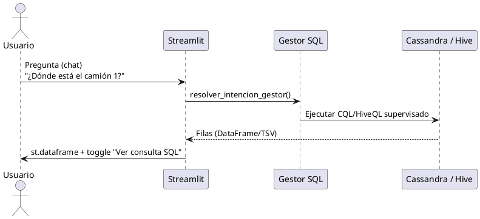
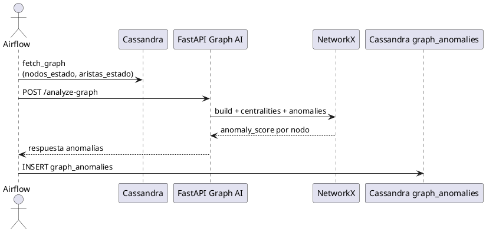

# Manual de Desarrollador — SIMLOG España

Guía para extender y operar la plataforma SIMLOG, incluyendo:

- **FAQ IA** (microservicio local + base de conocimiento JSON)
- **Asistente de Flota** (lenguaje natural → consultas supervisadas)
- **Graph AI** (FastAPI + NetworkX) para detección de anomalías
- Integración con **Cassandra**, **Hive**, **Airflow**

## 1. Estructura general (repo)

Componentes principales:

- `ingesta/`: genera snapshots (clima OpenWeather + incidentes + GPS simulado) y publica en Kafka + backup JSON en HDFS.
- `procesamiento/`: Spark (GraphFrames) → escribe en Cassandra y (opcionalmente) Hive.
- `orquestacion/`: DAGs Airflow.
- `servicios/`: módulos para Streamlit (UI) y consultas supervisadas (Cassandra/Hive).
- `servicios/api_faq_ia.py`, `servicios/ui_faq_ia.py`, `servicios/faq_knowledge_base.json`: FAQ IA operativa.
- `graph_ai/`: microservicio de análisis de grafos (FastAPI + NetworkX).
- `cassandra/esquema_logistica.cql`: DDL de tablas.

## 2. FAQ IA (microservicio local + KB JSON)

### 2.1 Qué hace

El FAQ IA resuelve preguntas frecuentes sobre operación y uso del proyecto sin salir del dashboard:

- arranque del stack,
- informes PDF,
- estado de NiFi,
- ubicaciones Swagger/OpenAPI,
- dudas recurrentes de consultas y servicios.

No utiliza un LLM externo. La recuperación se basa en:

- tokenización local,
- similitud léxica (`Jaccard`),
- similitud difusa (`SequenceMatcher`),
- base de conocimiento editable en JSON.

### 2.2 Módulos y responsables

- `servicios/api_faq_ia.py`
  - API FastAPI del FAQ.
  - Endpoints: `/health`, `/api/v1/faq/questions`, `/api/v1/faq/ask`.
  - Respuesta estructurada: `answer`, `confidence`, `matched_question`, `suggestions`, `sources`, `engine`.
- `servicios/ui_faq_ia.py`
  - Panel Streamlit embebido en la pestaña **Servicios**.
  - Consulta el microservicio, muestra respuesta y mantiene historial en `st.session_state`.
- `servicios/faq_knowledge_base.json`
  - Base versionada con `question`, `keywords`, `answer`, `sources`.

### 2.3 Arranque y documentación interactiva

```bash
cd ~/proyecto_transporte_global
source venv_transporte/bin/activate
uvicorn servicios.api_faq_ia:app --host 0.0.0.0 --port 8091
```

Documentación:

- Swagger UI: `http://<host>:8091/docs`
- ReDoc: `http://<host>:8091/redoc`
- OpenAPI JSON: `http://<host>:8091/openapi.json`

### 2.4 Cómo ampliar la base de conocimiento

1. Edita `servicios/faq_knowledge_base.json`.
2. Añade un objeto con:
   - `question`
   - `keywords`
   - `answer`
   - `sources`
3. Mantén respuestas cortas, operativas y trazables a ficheros reales.
4. Reinicia el servicio FAQ IA si quieres garantizar recarga limpia.

## 3. Asistente de Flota (lenguaje natural → CQL/HiveQL supervisado)

### 2.1 Qué hace

El asistente traduce una pregunta en lenguaje natural a:

- **CQL Cassandra** (tiempo real)
- **HiveQL** (histórico) usando PyHive

No ejecuta SQL arbitrario: usa **whitelist**/plantillas y heurísticas.

### 2.2 Módulos y responsables

- `servicios/ui_asistente_flota.py`
  - Interfaz Streamlit: `st.chat_input`, muestra `st.dataframe` y el toggle “Ver consulta SQL”.
  - Mantiene historial en `st.session_state`.
- `servicios/gestor_consultas_sql.py`
  - Mapeo (diccionario + heurísticas) de intención → SQL/CQL supervisado.
  - Extracción segura del identificador del camión (ej. `camion_1`, `CAM-001`).
- `servicios/consultas_cuadro_mando.py`
  - Expone `ejecutar_hive_sql_seguro(sql)` con ejecución segura vía PyHive.
  - Mantiene whitelist de consultas Cassandra/Hive para otras partes de la UI.

### 2.3 Integración Hive sin beeline de consola

`ejecutar_hive_sql_seguro()` usa PyHive contra HiveServer2:

- Host/puerto se obtiene de `HIVE_SERVER` o `HIVE_JDBC_URL`.
- Ajusta timeout con `HIVE_QUERY_TIMEOUT_SEC`.
- Intenta modos de auth compatibles (NOSASL/NONE) según entorno.

### 2.4 Extender el asistente (nuevo intent / nueva plantilla)

1. Añade una nueva intención en `resolver_intencion_gestor()` en `servicios/gestor_consultas_sql.py`.
2. Define la consulta supervisada:
   - Para Cassandra: asegúrate de que el esquema coincide con `cassandra/esquema_logistica.cql`.
   - Para Hive: define tabla/DDL existente (y ajusta `SIMLOG_HIVE_TABLA_TRANSPORTE` si el nombre difiere).
3. Si necesitas post-procesado (p.ej. ordenar top por `pagerank`), implementa el ajuste en el cliente antes del render (el asistente ya lo soporta en `aplicar_postproceso_gestor`).

## 4. Graph AI (FastAPI + NetworkX)

### 3.1 Qué hace

Microservicio desacoplado que:

1. Construye un grafo NetworkX desde JSON (`nodes[]`, `edges[]`).
2. Calcula métricas:
   - degree centrality
   - betweenness centrality (aproximada si el grafo crece)
   - pagerank
3. Detecta anomalías:
   - aislados
   - outliers por grado (z-score)
   - outliers por peso de aristas (z-score)
   - (opcional) cambios estructurales si aportas `previous_graph`
4. Asigna `anomaly_score` por nodo y devuelve lista de anomalías.

### 3.2 Estructura del código

- `graph_ai/models.py`: schemas Pydantic para requests/responses.
- `graph_ai/graph_processing.py`:
  - `build_nx_graph()`
  - `compute_centralities()`
  - `detect_anomalies()`
  - `compare_graphs()`
- `graph_ai/api.py`:
  - `POST /analyze-graph`
  - `POST /compare-graphs`
  - `GET /health`

### 3.3 Endpoints (ejemplos)

`POST /analyze-graph`:

Request:
```json
{
  "graph": {
    "directed": true,
    "nodes": [{"id": "A"}, {"id": "B"}],
    "edges": [{"source": "A", "target": "B", "weight": 10}]
  }
}
```

Response:
 - `centrality_metrics`
 - `anomaly_scores`
 - `anomalous_nodes`

### 3.4 Cassandra: persistencia de anomalías

Tabla:
- `cassandra/esquema_logistica.cql`: `graph_anomalies`

Columnas:
- `id` (UUID)
- `timestamp` (TIMESTAMP)
- `node_id` (TEXT)
- `anomaly_score` (DOUBLE)
- `metric_type` (TEXT)
- `metric_value` (DOUBLE)
- `ts_bucket` (BIGINT, bucket temporal de 15 min)

### 3.5 Elección de clave de partición

Se usa `ts_bucket` + `metric_type` en la PRIMARY KEY (y por tanto como parte de la partición efectiva):

- Facilita consultas típicas: “dame anomalías del último bucket” o “ventana reciente”.
- Limita el tamaño de particiones y reduce el scan por rango.
- Permite añadir tipos de métricas (metric_type) sin mezclar todo en una partición gigante.

### 3.6 Orquestación Airflow

El DAG está en:
- `orquestacion/dag_graph_ai_anomalias.py`

Ejecución:

1. Cada **15 minutos**, fetch del grafo desde Cassandra (`nodos_estado`, `aristas_estado`).
2. Llamada al microservicio `POST /analyze-graph`.
3. Inserción de anomalías en Cassandra (`graph_anomalies`).
4. (Opcional) publicación en Kafka.

## 5. Requisitos para correr Graph AI (FastAPI) en tu entorno

1. Instala dependencias del repo:

   ```bash
   pip install -r requirements.txt
   ```

2. Levanta el servicio:

   ```bash
   uvicorn graph_ai.api:app --host 0.0.0.0 --port 8001
   ```

3. Verifica:
   - `GET /health`
   - `POST /analyze-graph` con un ejemplo.

## 5.1 Swagger / OpenAPI (documentación interactiva)

Este proyecto usa **FastAPI**, por lo que incluye documentación interactiva **Swagger UI** y **ReDoc**.

### API principal SIMLOG (`servicios/api_simlog.py`)

Arranque típico:

```bash
uvicorn servicios.api_simlog:app --host 0.0.0.0 --port 8090
```

Documentación:
- Swagger UI: `http://<host>:8090/docs`
- ReDoc: `http://<host>:8090/redoc`
- Esquema OpenAPI JSON: `http://<host>:8090/openapi.json`

### Graph AI (`graph_ai/api.py`)

Arranque típico:

```bash
uvicorn graph_ai.api:app --host 0.0.0.0 --port 8001
```

Documentación:
- Swagger UI: `http://<host>:8001/docs`
- ReDoc: `http://<host>:8001/redoc`
- Esquema OpenAPI JSON: `http://<host>:8001/openapi.json`

### FAQ IA (`servicios/api_faq_ia.py`)

Arranque típico:

```bash
uvicorn servicios.api_faq_ia:app --host 0.0.0.0 --port 8091
```

Documentación:
- Swagger UI: `http://<host>:8091/docs`
- ReDoc: `http://<host>:8091/redoc`
- Esquema OpenAPI JSON: `http://<host>:8091/openapi.json`

Sugerencia: prueba endpoints directamente desde Swagger (botón “Try it out”) para validar payloads y respuestas.

## 5.2 Cluster Big Data en GitHub Codespaces (perfil aislado)

Para evitar conflictos con el stack principal del proyecto, el repositorio incorpora un perfil dedicado a Codespaces:

- `docker-compose.codespaces.yml`
- `Dockerfile.codespaces`
- `hadoop.codespaces.env`
- guía operativa: `docs/CODESPACES_CLUSTER.md`

### Flujo recomendado

1. Crear Codespace sobre `main`.
2. Ejecutar:

   ```bash
   docker compose -f docker-compose.codespaces.yml up -d --build
   docker compose -f docker-compose.codespaces.yml ps
   ```

3. En la pestaña **Ports**, marcar como `Public`:
   - `9870` (Hadoop NameNode UI)
   - `8080` (Spark Master UI)
   - `8888` (Jupyter)

4. Validar logs:

   ```bash
   docker compose -f docker-compose.codespaces.yml logs --tail=120 namenode
   docker compose -f docker-compose.codespaces.yml logs --tail=120 spark-master
   docker compose -f docker-compose.codespaces.yml logs --tail=120 kafka
   ```

### Notas de mantenimiento

- Este perfil no reemplaza `docker-compose.yml` del stack completo.
- Si hay presión de recursos en Codespaces, parar `python-env` (Jupyter) primero.
- No levantar simultaneamente perfil Codespaces y stack completo en el mismo entorno.

## 6. UML / Diagramas (PlantUML) para documentación

### 5.1 Secuencia — Asistente de Flota



### 5.2 Secuencia — Graph AI



## 7. Checklist de extensiones (para mantener coherencia)

## 7.1 Novedades UI (consultas, informes y navegacion)

Nuevos bloques relevantes:

- `servicios/cuadro_mando_ui.py`
  - **Informes a medida (plantillas + PDF)**:
    - descubrimiento de tablas/columnas por motor,
    - modo `SELECT *` y modo por campos,
    - filtros (`WHERE`), orden (`ORDER BY`), limite,
    - export PDF (`reportlab`),
    - plantillas personalizadas persistidas en `servicios/report_templates.json`.
  - **Consultas libres seguras**:
    - Cassandra: `SELECT` via `ejecutar_cassandra_cql_seguro()`.
    - Hive: `SHOW|SELECT|WITH|DESCRIBE` via `ejecutar_hive_sql_seguro()`.

- `servicios/consultas_cuadro_mando.py`
  - Descubrimiento de metadata:
    - `listar_keyspaces_cassandra()`
    - `listar_tablas_cassandra()`
    - `listar_columnas_cassandra()`
    - `listar_tablas_hive()`
    - `listar_columnas_hive()`

- `app_visualizacion.py`
  - **Buscador semantico rapido** en cabecera.
  - Navegacion determinista por `active_tab` al pulsar hallazgos.
  - Mejora de presentacion (branding en sidebar + cabecera).

- `servicios/ui_faq_ia.py`
  - Panel FAQ IA integrado en **Servicios**.
  - Historial de preguntas por sesión.
  - Respuesta con confianza, coincidencia principal, sugerencias y fuentes.

## 7.2 Servicios del stack: Swagger API incluido

Se integra `api` como servicio gestionable:

- Archivo: `servicios/gestion_servicios.py`
- Operaciones:
  - `comprobar_api()`
  - `iniciar_api()` (lanza `uvicorn servicios.api_simlog:app`)
  - `parar_api()`
- Puerto configurable:
  - `SIMLOG_PORT_API` (default `8090`)

Enlaces de interfaz:

- Archivo: `servicios/ui_servicios_web.py`
- Entrada nueva: `api` con URL por defecto `http://127.0.0.1:8090/docs`.

FAQ IA como servicio gestionable:

- Archivo: `servicios/gestion_servicios.py`
- Operaciones:
  - `comprobar_faq_ia()`
  - `iniciar_faq_ia()`
  - `parar_faq_ia()`
- Puerto configurable:
  - `SIMLOG_PORT_FAQ_IA` (default `8091`)

Antes de añadir nuevas funcionalidades:

- Validar que las columnas reales coinciden con `cassandra/esquema_logistica.cql`.
- Para Hive: validar el DDL de la tabla histórica y rutas/estructuras anidadas del JSON.
- Evitar SQL dinámico del usuario (siempre whitelist/plantillas).
- No acoplar Graph AI con Spark: Graph AI solo consume grafo materializado.

